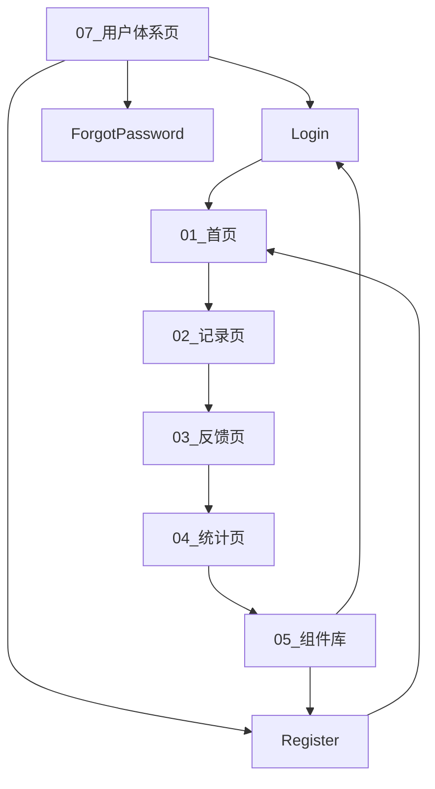

AI 情绪日记 APP Figma 文件搭建指南


一、文件架构


```
├── 01\_首页（Home）


├── 02\_情绪记录页（Record）


├── 03\_AI反馈页（Analysis）


├── 04\_统计分析页（Stats）


├── 05\_组件库（Components）


├── 06\_样式指南（Style Guide）


├── \*\*07\_用户体系页（User Auth）\*\*  \<!-- 新增章节 -->


│   ├── Login（登录页）


│   ├── Register（注册页）


│   ├── ForgotPassword（找回密码页）


└── 08\_原型交互说明（Prototype Logic）
```

二、新增 07\_用户体系页（User Auth）设计


### 7.1 登录页面（Login）&#xA;

#### 页面布局&#xA;


#### 核心组件设计&#xA;


*   **手机号登录模块**


```
▶ 输入框： &#x20;


&#x20; \- 占位符「请输入11位手机号」，边框默认#E0E0E0，错误时变红#FF6B6B &#x20;


&#x20; \- 自动校验格式，支持一键复制粘贴 &#x20;


▶ 密码输入框： &#x20;


&#x20; \- 占位符「请输入6-16位密码」，右侧眼睛图标切换密码可见性（点击态图标旋转180°） &#x20;
```


*   **第三方登录模块**


```
▶ 按钮设计： &#x20;


&#x20; \- 微信图标：#1A73E8（品牌绿），邮箱图标：#EA4335（邮箱红） &#x20;


&#x20; \- 尺寸40px×40px，点击态添加10%透明度阴影（Elevation 2） &#x20;


▶ 文案布局： &#x20;


&#x20; \- 「或使用第三方登录」居中显示，上方分隔线高度1px，颜色#F5F5F5 &#x20;
```

#### 状态与交互&#xA;


*   **加载态**：登录按钮文字切换为「登录中...」，右侧显示圆形加载动画（Figma 组件变体标记）


*   **错误提示**：手机号格式错误时，下方浮出红色提示条「手机号格式不正确」，1.5 秒后渐隐


*   **隐私控制**：「记住密码」勾选框关联 Cookie 存储，点击时弹出隐私政策弹窗（Figma 注释标注逻辑）


### 7.2 注册页面（Register）&#xA;

#### 分步表单设计&#xA;


```
▌第一步：基础信息 &#x20;


▶ 用户名输入框： &#x20;


&#x20; \- 占位符「昵称（2-10个字符）」，实时检测重复（可用时显示绿色对勾图标） &#x20;


▶ 手机号输入框： &#x20;


&#x20; \- 同登录页样式，右侧「获取验证码」按钮，点击后倒计时60秒（禁用态灰色#95A5A6） &#x20;


▌第二步：密码设置 &#x20;


▶ 密码强度提示： &#x20;


&#x20; \- 弱（红色）：仅数字/字母，长度<8位 &#x20;


&#x20; \- 中（黄色）：数字+字母，长度8-12位 &#x20;


&#x20; \- 强（绿色）：数字+字母+符号，长度>12位 &#x20;


▶ 确认密码输入：输入不一致时显示红色提示「两次密码不匹配」 &#x20;


▌第三步：隐私协议 &#x20;


▶ 勾选框：16px×16px，未选中时空心，选中后填充主色#4A90E2 &#x20;


▶ 文案链接：《用户协议》《隐私政策》用蓝色#2196F3，下划线悬停效果 &#x20;
```

#### 防疲劳设计&#xA;


*   键盘交互：输入用户名时自动隐藏系统键盘右侧功能键（Figma 注释标注「IME Options=actionDone」）


*   快捷注册：检测到微信授权时，自动填充用户名（预留开发接口注释）


### 7.3 组件库新增组件&#xA;


| 组件类型&#xA;    | 名称&#xA;     | 设计要点&#xA;                                           | 复用场景&#xA;           |
| ------------ | ----------- | --------------------------------------------------- | ------------------- |
| 输入框组件&#xA;   | 带校验输入框&#xA; | 包含正常态 / 错误态 / 加载态变体，错误态边框 + 1px 红色描边，关联浮动提示条组件&#xA; | 登录 / 注册 / 找回密码&#xA; |
| 第三方登录按钮&#xA; | 社交图标按钮&#xA; | 统一尺寸 40px×40px，品牌色填充，点击态透明度 80%，阴影 Elevation 4&#xA; | 登录页 / 设置页&#xA;      |
| 隐私协议模块&#xA;  | 勾选链接组合&#xA; | 勾选框与链接水平排列，间距 8px，链接文字样式 #2196F3，14px 常规字重&#xA;     | 注册页 / 账号安全页&#xA;    |

三、与原有模块的衔接


### 3.1 首页交互联动&#xA;


*   冷启动状态（未登录）：点击首页「+」按钮时，先跳转登录页，登录成功后返回记录流程（Figma 原型设置 Conditional Link：未登录→Login，已登录→Record）


*   已登录用户：首页直接显示当日情绪概览，「+」按钮触发记录浮层


### 3.2 个人中心衔接&#xA;


*   「退出登录」按钮：点击后清除本地 Token，跳转登录页并重置用户状态（Figma 注释标注「LocalStorage.clear ('token')」）


*   数据管理页面：显示「一键删除所有记录」按钮，操作需二次确认（弹出 Modal 对话框）


四、隐私合规设计强化


### 4.1 权限声明&#xA;


*   登录页底部添加固定文案：「我们严格保护你的隐私，绝不向第三方共享个人信息」，点击链接至《隐私政策》详情页（Figma 中用超链接标记）


*   注册页隐私协议勾选框强制关联：未勾选时「注册」按钮置灰，提示「请阅读并同意用户协议」


### 4.2 数据加密标注&#xA;


*   密码输入框：Figma 注释明确「需在本地使用 AES-256 加密后再传输，前端显示掩码●●●●●●」


*   手机号 / 验证码：传输时添加 HTTPS 加密，接口文档标注「敏感字段需脱敏处理」


五、更新后文件结构示意图




六、交付物更新说明


1.  **新增页面**：在 Figma 中创建独立 Page「07\_User\_Auth」，包含 Login、Register、ForgotPassword 三个子页面


2.  **组件复用**：登录 / 注册页输入框直接调用「05\_Components\_Library」中的「带校验输入框」组件，确保样式统一


3.  **交互标记**：在原型模式中设置登录→首页、注册→登录的条件跳转逻辑，标注「User Token 状态判断」


4.  **开发备注**：在 Figma 评论区补充「第三方登录需对接微信 / 邮箱开放平台 API」「密码加密需后端配合解密」等技术说明


通过此次更新，Figma 文件已完整覆盖用户从注册到情绪记录的全流程，同时强化了隐私合规和交互一致性。建议在开发前进行跨团队评审，重点确认用户体系与核心功能的数据交互逻辑，确保后续接口对接顺畅。