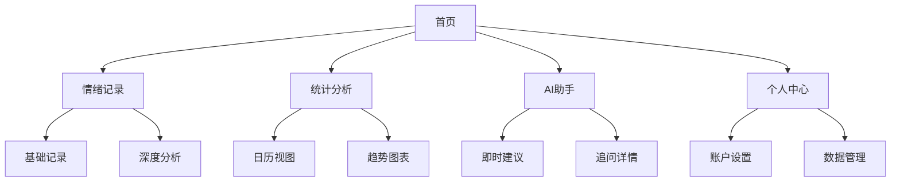
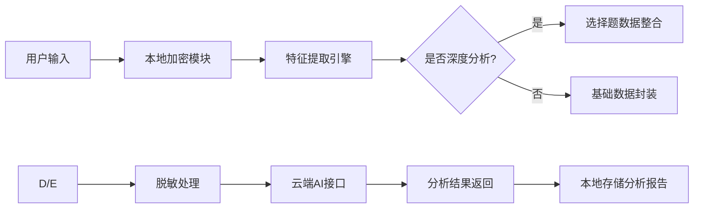

AI 情绪日记 APP 产品设计方案


一、整体设计理念


### 1.1 设计原则&#xA;


*   **轻量化优先**：核心操作路径（记录→分析）控制在 3 步内，深度功能采用「渐进式披露」设计（默认隐藏，用户主动触发）


*   **数据可视化**：通过色块、雷达图、趋势曲线等图形化元素降低认知成本，符合移动端碎片化阅读习惯


*   **情感化交互**：采用柔和配色（主色调 #4A90E2）、圆润图标（拟物化情绪标签）和轻量级动效（如记录成功时的轻微弹性反馈）


### 1.2 信息架构图&#xA;




二、核心页面交互设计


### 2.1 首页（TabBar 导航）&#xA;

#### 设计要点：&#xA;


*   **黄金位置布局**：底部中间「+」按钮采用凸出设计（尺寸比两侧图标大 20%），点击触发「记录浮层」


*   **快捷入口**：


    *   左上角「日历」直接进入统计页面


    *   右上角「AI 助手」可发起文字咨询（MVP 暂预留入口，后续迭代开发）


*   **状态展示**：顶部显示当日情绪概览（例："今日情绪：焦虑（7 分）・触发场景：工作"）


#### 交互流程：&#xA;


1.  冷启动状态：引导用户完成首次记录（浮层提示："点击开始今天的情绪日记吧～"）


2.  常规状态：滑动切换「推荐」「我的」双 tab，推荐页后期可接入心理科普内容


### 2.2 情绪记录页（核心任务页）&#xA;

#### 2.2.1 基础记录模式（默认展开）&#xA;


（注：此处为示意，实际需链接 Figma 原型）


*   **文本输入区**：


    *   占位符提示："今天发生了什么？一句话描述也可以"


    *   右下角显示字数统计（实时更新，超过 200 字时变红警示）


*   **标签选择区**：


    *   情绪标签：横向滑动列表，选中标签放大 + 颜色高亮（例：焦虑标签为橙色）


    *   场景标签：采用「勾选式」设计，默认选中「生活」，点击切换其他场景


#### 2.2.2 深度分析模块（折叠态，点击展开）&#xA;


*   **触发设计**：


    *   文本输入后自动扫描关键词（如 "加班"" 吵架 "），底部浮出提示条：" 补充几个小问题，让 AI 更懂你 ❓"


    *   手动触发：点击「展开详细分析」按钮（图标为放大镜 + 加号）


*   **问题呈现**：


    *   采用「抽屉式」从底部滑出，单屏显示 1 题，左右滑动切换（避免页面跳转）


    *   示例问题：" 这种情绪让你身体有什么反应？A. 心跳加速 B. 胸闷气短 C. 无明显反应"


### 2.3 AI 反馈页（结果呈现页）&#xA;

#### 2.3.1 基础分析卡片&#xA;


*   **左侧雷达图**：


    *   6 个情绪维度环形分布，当前情绪用粗线突出（例：焦虑维度占比 60%）


    *   点击单个维度显示历史对比："本周焦虑值较上周下降 12%"


*   **右侧建议列表**：


    *   每条建议前用图标区分类型：即时疏导（闪电图标）/ 长期改善（齿轮图标）


    *   交互细节：长按建议触发「收藏」或「分享」，点击进入「建议详情页」（含步骤分解图 / 视频）


#### 2.3.2 深度分析扩展&#xA;


*   若用户完成选择题，新增「数据洞察」模块：


```
\*\*你的情绪触发器\*\* &#x20;


▶ 具体事件（70%）＞ 身体状态（20%）＞ 无明显原因（10%） &#x20;


\*\*认知模式分析\*\* &#x20;


你更倾向「分析问题」（65%），偶尔出现「自我否定」（30%） &#x20;
```


*   **隐私提示**：在卡片底部用浅灰色小字标注："你的记录仅存储在本地，云端不保留原文"


### 2.4 统计分析页（数据复盘页）&#xA;

#### 2.4.1 日历视图&#xA;


*   **日期块设计**：


    *   颜色映射：红色（愤怒）/ 橙色（焦虑）/ 绿色（平静），颜色深浅代表情绪强度


    *   特殊标记：连续记录 7 天的日期显示「成就徽章」（如星星图标）


*   **交互操作**：


    *   长按日期可快速编辑 / 删除记录


    *   双指缩放切换月 / 周视图（MVP 暂实现月视图）


#### 2.4.2 趋势图表&#xA;


*   **情绪分布饼图**：


    *   动态对比：显示当前周期与上一周期的占比变化（例："焦虑下降↑5% 平静↑10%"）


*   **场景 - 情绪矩阵**：


    *   横轴为场景（工作 / 学习 / 生活），纵轴为情绪类型，色块面积代表出现频率


三、关键交互细节


### 3.1 轻量化输入优化&#xA;


| 场景&#xA;  | 交互优化方案&#xA;                                 | 目标&#xA;      |
| -------- | ------------------------------------------- | ------------ |
| **快捷记录** | 左滑首页直接调出标签选择浮层，无需进入二级页面&#xA;                | 耗时＜10 秒&#xA; |
| **语音输入** | 点击麦克风图标启动录音，结束后自动生成文本（可选编辑），并识别关键词推荐标签&#xA; | 提升输入效率&#xA;  |
| **标签记忆** | 自动记录用户常用标签（前 3 位固定显示），减少重复选择成本&#xA;         | 降低认知负荷&#xA;  |

### 3.2 游戏化激励体系（MVP 预留接口）&#xA;


*   **成就系统**：


    *   基础成就：连续记录 3 天解锁「青铜记录者」徽章


    *   深度成就：累计完成 10 次深度分析解锁「情绪洞察者」称号


*   **能量值机制**：


    *   每次记录获得 10 能量值，可兑换 AI 语音疏导服务（100 能量 = 1 次）


    *   能量值排行榜（仅显示好友排名前 10，保护隐私）


### 3.3 数据安全可视化&#xA;


*   **本地存储提示**：在个人中心「数据管理」页面显示："你的日记已通过 AES-256 加密存储在本地📱"


*   **权限说明**：首次申请权限时用弹窗解释："我们仅需要通知权限来提醒你记录，绝不收集其他信息"


四、界面设计规范


### 4.1 配色方案&#xA;


| 颜色用途&#xA; | 主色&#xA;            | 辅助色&#xA;          | 对比色&#xA;          | 中性色&#xA;          |
| --------- | ------------------ | ----------------- | ----------------- | ----------------- |
| **情绪标签**  | #FF6B6B (愤怒)&#xA;  | #FFD700 (快乐)&#xA; | #4A90E2 (焦虑)&#xA; | #95A5A6 (灰色)&#xA; |
| **操作按钮**  | #4CAF50 (主行动)&#xA; | #F44336 (删除)&#xA; | #2196F3 (次级)&#xA; | #FFFFFF (背景)&#xA; |
| **数据图表**  | 渐变色填充&#xA;         | 单色块区分&#xA;        | 高亮描边&#xA;         | 浅灰色网格线&#xA;       |

### 4.2 图标设计原则&#xA;


*   **拟物化风格**：情绪标签采用具象化图标（如愤怒→火焰，平静→树叶）


*   **可识别性**：图标尺寸≥24px，重要操作图标（如「+」）尺寸≥40px


*   **动态反馈**：点击图标时添加 0.3 秒的按压动效，增强交互反馈


### 4.3 字体规范&#xA;


| 模块&#xA;  | 字体&#xA;     | 字号&#xA;   | 字重&#xA; | 颜色&#xA;      | 示例&#xA;       |
| -------- | ----------- | --------- | ------- | ------------ | ------------- |
| **标题**   | 苹方 - 简&#xA; | 20px&#xA; | 粗体&#xA; | #333333&#xA; | "今日情绪分析"&#xA; |
| **正文**   | 苹方 - 简&#xA; | 16px&#xA; | 常规&#xA; | #666666&#xA; | 建议内容&#xA;     |
| **提示文本** | 苹方 - 简&#xA; | 14px&#xA; | 细体&#xA; | #999999&#xA; | "点击展开更多"&#xA; |

五、数据流转与权限控制


### 5.1 数据处理流程图&#xA;




### 5.2 隐私保护机制&#xA;


*   **数据分级**：


    *   敏感数据（文本 / 选择题答案）：本地加密存储，不联网传输


    *   匿名数据（标签统计 / 趋势）：去标识化处理后用于模型优化（需用户授权）


*   **权限最小化**：


    *   仅在用户主动使用语音输入时申请麦克风权限


    *   关闭 APP 后自动清除内存中的临时数据


六、与需求文档的对应关系


| 需求模块&#xA;    | 设计实现点&#xA;                          | 补充说明&#xA;             |
| ------------ | ----------------------------------- | --------------------- |
| 深度分析选择题&#xA; | 抽屉式滑动问题、关键词智能触发、循证心理学问题库&#xA;       | 首期实现 3 类共 15 道问题&#xA; |
| AI 建议生成&#xA; | 双类型建议卡片、追问交互、步骤分解图&#xA;             | 建议准确率≥80%（初期）&#xA;    |
| 统计导出功能&#xA;  | PDF 报告包含图表 + 建议摘要、免费用户每月 3 次限制&#xA; | 导出时自动隐藏原始文本&#xA;      |
| 快捷记录模式&#xA;  | 左滑调出标签浮层、一句话快速输入&#xA;               | 支持纯标签无文本记录&#xA;       |

七、下一步计划


### 7.1 交付物清单&#xA;


*   高保真原型图（Figma 文件，含交互说明）


*   设计规范手册（Sketch 文件，含组件库）


*   数据交互文档（Swagger 接口说明）


### 7.2 开发对接要点&#xA;


*   前端：采用 Uniapp 组件库实现跨平台一致性


*   后端：确保 AI 接口响应时间≤2 秒，支持 500 并发请求


*   测试：重点验证不同网络环境下的加载速度、极端数据量下的图表渲染性能


### 7.3 风险应对&#xA;


*   **设计还原度不足**：开发前召开视觉走查会，明确动效实现优先级（关键反馈动效必须实现，过渡动效可降级）


*   **用户学习成本高**：在设置页增加「交互指南」视频，首次触发深度分析时显示浮层教程


通过以上设计，既保持了 MVP 的轻量化核心，又为后续功能扩展预留了模块化接口，同时通过心理学专业设计和数据安全机制建立用户信任。建议在设计评审后同步启动高保真原型开发，预计 2 周内完成可交互 Demo 用于用户测试。